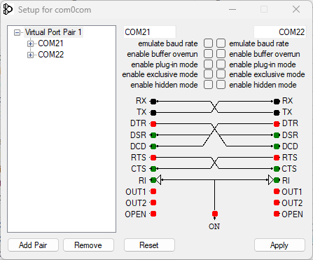

# AV-Datalogger Serial Simulator

# Description

This project setups up a simulator that communicates with the AV-Datalogger via serial communication.
The simulator is used to test the AV-Datalogger without the need of the actual hardware.

This project has only been tested on Windows, this tool is only intended to be used on Windows during development.

# Requirements

## Build

To build the project you need to install the dotnet sdk 8.0.x.
You can download the sdk [here](https://dotnet.microsoft.com/download/dotnet/8.0).

## Setup

To run this project you need to install com0com, a virtual serial port driver. During testing, the only version that
worked on Windows 11 is v2.2.2.0.
Download the driver [here](https://sourceforge.net/projects/com0com/files/com0com/2.2.2.0).

After installing, ensure your virtual ports are set up correctly. You can do this by ensuring your com0com GUI looks
like
the following (pay attention to the port names):

You also need to have a functioning python (3.x - latest preferred) installation, with python on path. This script
automatically sets up a
virtual environment and installs the required packages.

## Running

Run the program after running the AV-Datalogger. The program will automatically connect to the AV-Datalogger and start
sending data.

For convenience, when using rider you can run both at once by running the `Multi-Launch: AV-Datalogger` configuration.